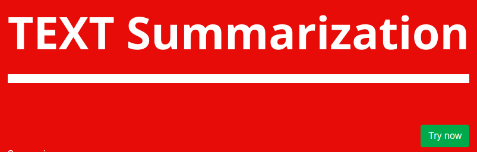
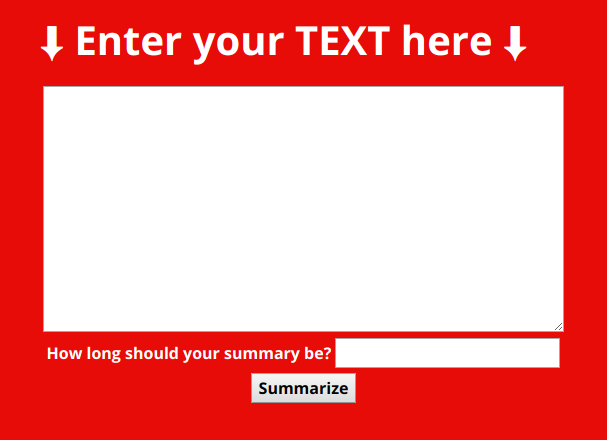

# textSummarization
Website for Text Summarization with Python backend using Flask
Download the data required : [embeddings.npy](/)

Summarization done using algorithm : [Text Rank Algorithm](https://www.analyticsvidhya.com/blog/2018/11/introduction-text-summarization-textrank-python/)

**Home Page**

**Enter text details**

